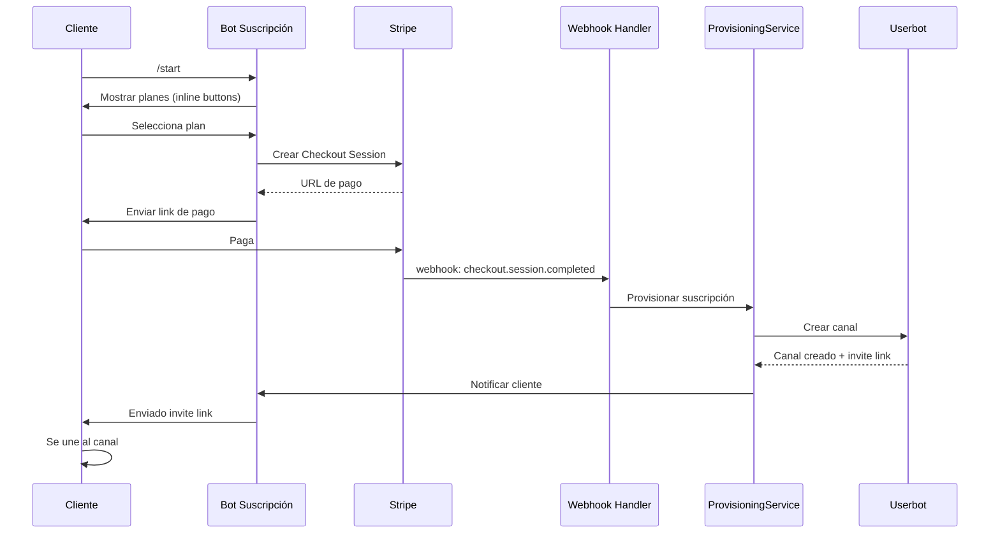

# ADR-016: Sistema de Suscripciones Automatizado

**Fecha**: Diciembre 2025  
**Estado**: Propuesto  
**Contexto**: Implementación de sistema de suscripciones con canales exclusivos por cliente

---

## 1. Resumen Ejecutivo

Sistema automatizado donde cada cliente suscrito recibe un canal de Telegram exclusivo para las softs contratadas. El flujo es completamente automático: **selección → pago → provisioning → acceso**.

---

## 2. Decisiones Técnicas

### 2.1 Telegram: Canales con Userbot (Telethon)

#### Problema
Los bots de Telegram (Bot API) no pueden crear canales. Solo pueden:
- Ser añadidos como admin a canales existentes
- Enviar mensajes si son admin
- Generar links de invitación si son admin

#### Alternativas Evaluadas

| Opción                | Descripción                           | Veredicto                                     |
| --------------------- | ------------------------------------- | --------------------------------------------- |
| Grupos (Bot API)      | Bots SÍ pueden crear grupos           | ❌ Menos profesional, usuarios pueden escribir |
| Pool pre-creado       | Crear canales manualmente, asignar    | ❌ No escala, gestión manual                   |
| **Userbot (MTProto)** | Cuenta de usuario automatizada        | ✅ Elegido                                     |
| Canal compartido      | Un canal por soft, todos los clientes | ❌ Sin exclusividad                            |

#### Decisión: Userbot con Telethon

**Justificación**:
- Única forma de crear canales programáticamente
- Canales dan imagen más profesional que grupos
- Historial visible para nuevos miembros
- Usuarios no pueden "ensuciar" el canal
- Notificaciones silenciadas por defecto

#### Riesgos y Mitigaciones

| Riesgo                 | Probabilidad | Impacto | Mitigación                                              |
| ---------------------- | ------------ | ------- | ------------------------------------------------------- |
| Ban de cuenta          | Baja         | Alto    | Usar cuenta dedicada, no spam, delays entre operaciones |
| Cambios en API MTProto | Baja         | Medio   | Telethon bien mantenido, comunidad activa               |
| Límites de creación    | Media        | Medio   | Rate limiting interno, cola de provisioning             |

#### Requisitos
- Cuenta de Telegram dedicada (número de teléfono)
- Credenciales MTProto de my.telegram.org: `api_id`, `api_hash`
- Sesión persistente (archivo `.session`)

---

### 2.2 Pagos: Arquitectura Multi-Gateway

#### Decisión Inicial: Stripe

Stripe es el proveedor inicial por su robustez, pero la arquitectura está diseñada para soportar múltiples proveedores.

| Opción     | Pros                                                 | Contras                              | Veredicto |
| ---------- | ---------------------------------------------------- | ------------------------------------ | --------- |
| **Stripe** | Webhooks robustos, SDK Python, suscripciones nativas | Comisión ~2.9% + 0.25€               | ✅ Inicial |
| PayPal     | Conocido                                             | Webhooks menos fiables, más fricción | 🔄 Futuro  |
| Cryptomus  | Crypto nativo                                        | Sin suscripciones nativas            | 🔄 Futuro  |

#### Arquitectura Multi-Gateway

```
domain/ports/
└── payment_gateway.py    ← Interfaz abstracta (puerto)

infrastructure/payments/
├── gateway_factory.py    ← Factory para instanciar gateways
├── stripe/               ← Adaptador Stripe
│   ├── stripe_gateway.py
│   └── stripe_config.py
├── paypal/               ← Futuro
└── cryptomus/            ← Futuro
```

**Principio**: Dependency Inversion. El dominio define el puerto (PaymentGateway), la infraestructura provee adaptadores.

#### PaymentGateway Interface

```python
class PaymentGateway(ABC):
    @abstractmethod
    async def create_checkout_session(...) -> CheckoutSession: ...
    
    @abstractmethod
    async def cancel_subscription(subscription_id: str) -> bool: ...
    
    @abstractmethod
    def parse_webhook(payload: bytes, signature: str) -> PaymentEvent: ...
```

#### Eventos Normalizados

| PaymentEvent.event_type | Stripe                        | PayPal           |
| ----------------------- | ----------------------------- | ---------------- |
| payment_completed       | checkout.session.completed    | PAYMENT.CAPTURE  |
| payment_failed          | invoice.payment_failed        | PAYMENT.FAILED   |
| subscription_cancelled  | customer.subscription.deleted | SUBSCRIPTION.END |

---

### 2.3 Web: FastAPI + Jinja2

**Decisión**: Landing page minimalista con:
- Información del servicio
- FAQs
- Términos y Condiciones
- Política de Privacidad
- Enlaces al bot de Telegram
- Endpoint para webhooks de Stripe

**Justificación**:
- FastAPI: Async nativo, compatible con el stack actual
- Jinja2: Templates simples, sin SPA innecesaria
- Mismo proceso o separado según necesidad

---

### 2.4 Base de Datos: PostgreSQL (asyncpg)

**Decisión**: Extender PostgreSQL existente con tablas para:
- `customers`: Datos del cliente
- `service_plans`: Planes disponibles (softs)
- `subscriptions`: Suscripciones activas
- `telegram_channels`: Canales creados

**Justificación**:
- Ya tienes `asyncpg` como dependencia
- Modelo relacional ideal para suscripciones
- Transacciones ACID para consistencia

---

### 2.5 Arquitectura de Bots

```
┌─────────────────────────────────────────────────────────┐
│                    TELEGRAM LAYER                        │
├─────────────────────────────────────────────────────────┤
│                                                          │
│  ┌──────────────────┐     ┌──────────────────────────┐  │
│  │   USERBOT        │     │   BOT DE SUSCRIPCIÓN     │  │
│  │   (Telethon)     │     │   (aiogram)              │  │
│  │                  │     │                          │  │
│  │ • Crear canales  │     │ • /start, /planes        │  │
│  │ • Añadir admins  │     │ • /estado, /cancelar     │  │
│  │ • Gen. invites   │     │ • Inline buttons         │  │
│  │                  │     │ • Notificaciones         │  │
│  │ Cuenta: dedicada │     │ Token: @RetadorBot       │  │
│  └──────────────────┘     └──────────────────────────┘  │
│                                                          │
│  ┌──────────────────────────────────────────────────┐   │
│  │         BOTS DE ENVÍO (x5) - aiogram             │   │
│  │                                                   │   │
│  │ • Enviar picks a canales de clientes             │   │
│  │ • Rotación para rate limiting                    │   │
│  │ • Añadidos como admin por userbot                │   │
│  └──────────────────────────────────────────────────┘   │
│                                                          │
└─────────────────────────────────────────────────────────┘
```

---

## 3. Estructura de Carpetas

Ver [Estructura de Carpetas](#estructura-de-carpetas-completa) en el apéndice.

---

## 4. Modelo de Datos

```sql
-- Clientes (sin IDs de pasarelas - ver payment_accounts)
CREATE TABLE customers (
    id UUID PRIMARY KEY DEFAULT gen_random_uuid(),
    telegram_id BIGINT UNIQUE NOT NULL,
    telegram_username VARCHAR(255),
    email VARCHAR(255),
    created_at TIMESTAMPTZ DEFAULT NOW(),
    updated_at TIMESTAMPTZ DEFAULT NOW()
);

-- Cuentas de pago externas (multi-gateway)
CREATE TABLE payment_accounts (
    id UUID PRIMARY KEY DEFAULT gen_random_uuid(),
    customer_id UUID NOT NULL REFERENCES customers(id) ON DELETE CASCADE,
    provider VARCHAR(50) NOT NULL,          -- stripe, paypal, cryptomus
    external_customer_id VARCHAR(255) NOT NULL,
    is_active BOOLEAN DEFAULT TRUE,
    created_at TIMESTAMPTZ DEFAULT NOW(),
    UNIQUE(customer_id, provider)
);

-- Planes de servicio (sin IDs de precios - ver plan_payment_prices)
CREATE TABLE service_plans (
    id UUID PRIMARY KEY DEFAULT gen_random_uuid(),
    soft_id VARCHAR(50) UNIQUE NOT NULL,    -- 'retabet', 'sportium'
    name VARCHAR(100) NOT NULL,
    description TEXT,
    price_cents INTEGER NOT NULL,
    currency VARCHAR(3) DEFAULT 'EUR',
    is_active BOOLEAN DEFAULT TRUE,
    created_at TIMESTAMPTZ DEFAULT NOW()
);

-- Precios externos por proveedor (multi-gateway)
CREATE TABLE plan_payment_prices (
    id UUID PRIMARY KEY DEFAULT gen_random_uuid(),
    plan_id UUID NOT NULL REFERENCES service_plans(id) ON DELETE CASCADE,
    provider VARCHAR(50) NOT NULL,          -- stripe, paypal, cryptomus
    external_price_id VARCHAR(255) NOT NULL,
    is_active BOOLEAN DEFAULT TRUE,
    created_at TIMESTAMPTZ DEFAULT NOW(),
    UNIQUE(plan_id, provider)
);

-- Suscripciones (agnóstico de proveedor)
CREATE TABLE subscriptions (
    id UUID PRIMARY KEY DEFAULT gen_random_uuid(),
    customer_id UUID REFERENCES customers(id),
    plan_id UUID REFERENCES service_plans(id),
    external_subscription_id VARCHAR(255),
    payment_provider VARCHAR(50) NOT NULL,  -- stripe, paypal, cryptomus
    status VARCHAR(50) NOT NULL,            -- active, canceled, past_due
    current_period_start TIMESTAMPTZ,
    current_period_end TIMESTAMPTZ,
    cancel_at_period_end BOOLEAN DEFAULT FALSE,
    created_at TIMESTAMPTZ DEFAULT NOW(),
    updated_at TIMESTAMPTZ DEFAULT NOW(),
    UNIQUE(customer_id, plan_id)
);

-- Canales de Telegram (uno por suscripción)
CREATE TABLE telegram_channels (
    id UUID PRIMARY KEY DEFAULT gen_random_uuid(),
    subscription_id UUID UNIQUE REFERENCES subscriptions(id),
    channel_id BIGINT UNIQUE NOT NULL,
    channel_title VARCHAR(255),
    invite_link VARCHAR(255),
    is_active BOOLEAN DEFAULT TRUE,
    created_at TIMESTAMPTZ DEFAULT NOW()
);

-- Índices
CREATE INDEX idx_customers_telegram ON customers(telegram_id);
CREATE INDEX idx_payment_accounts_customer ON payment_accounts(customer_id);
CREATE INDEX idx_plan_prices_plan ON plan_payment_prices(plan_id);
CREATE INDEX idx_subscriptions_customer ON subscriptions(customer_id);
CREATE INDEX idx_subscriptions_status ON subscriptions(status);
CREATE INDEX idx_subscriptions_provider ON subscriptions(payment_provider);
CREATE INDEX idx_channels_active ON telegram_channels(is_active) WHERE is_active = TRUE;
```

---

## 5. Flujo de Provisioning



---

## 6. Nuevas Dependencias

```txt
# requirements.txt - AÑADIR

# Pagos
stripe>=7.0.0

# Userbot Telegram (MTProto)
telethon>=1.34.0

# Web
fastapi>=0.109.0
uvicorn>=0.27.0
jinja2>=3.1.0
python-multipart>=0.0.6
```

---

## 7. Variables de Entorno Nuevas

```env
# === STRIPE ===
STRIPE_SECRET_KEY=sk_test_xxx
STRIPE_PUBLISHABLE_KEY=pk_test_xxx
STRIPE_WEBHOOK_SECRET=whsec_xxx
STRIPE_PRICE_RETABET=price_xxx
STRIPE_PRICE_SPORTIUM=price_xxx

# === USERBOT (MTProto) ===
TELEGRAM_API_ID=12345678
TELEGRAM_API_HASH=abcdef1234567890
TELEGRAM_USERBOT_SESSION=userbot_session
TELEGRAM_USERBOT_PHONE=+34600000000

# === BOT DE SUSCRIPCIÓN ===
TELEGRAM_SUBSCRIPTION_BOT_TOKEN=123456:ABC-xxx

# === WEB ===
WEB_HOST=0.0.0.0
WEB_PORT=8000
WEB_BASE_URL=https://retador.es
```

---

## 8. Estimación de Implementación

| Fase            | Tareas                                | Horas Est. |
| --------------- | ------------------------------------- | ---------- |
| Setup           | Estructura, dependencias, env vars    | 2-3h       |
| Entidades       | Customer, Plan, Subscription, Channel | 3-4h       |
| Stripe          | Client, Config, Webhook handler       | 4-5h       |
| Userbot         | Telethon client, Channel provisioner  | 4-5h       |
| Bot suscripción | Comandos, inline buttons, flujo       | 4-5h       |
| Repositories    | CRUD PostgreSQL                       | 3-4h       |
| Provisioning    | Orquestación completa                 | 3-4h       |
| Pick Router     | Integración con core                  | 2-3h       |
| Web             | FastAPI, templates básicos            | 3-4h       |
| Tests           | Unit + Integration                    | 4-5h       |
| **Total**       |                                       | **32-42h** |

---

## 9. Riesgos

| Riesgo                 | Prob. | Impacto | Mitigación                               |
| ---------------------- | ----- | ------- | ---------------------------------------- |
| Ban userbot            | Baja  | Alto    | Cuenta dedicada, rate limiting, delays   |
| Fallo webhook Stripe   | Baja  | Alto    | Retry automático de Stripe, idempotencia |
| Canal no creado        | Baja  | Alto    | Cola de reintentos, alertas              |
| Cliente no se une      | Media | Bajo    | Recordatorios automáticos                |
| Cancelación inesperada | Media | Medio   | Webhook subscription.deleted, limpieza   |

---

## Apéndice: Estructura de Carpetas Completa

```
src/
├── subscriptions/                    # 🆕 NUEVO MÓDULO
│   ├── __init__.py
│   ├── domain/
│   │   ├── __init__.py
│   │   ├── entities/
│   │   │   ├── __init__.py
│   │   │   ├── customer.py
│   │   │   ├── service_plan.py
│   │   │   ├── subscription.py
│   │   │   ├── payment_account.py    # 🆕 Multi-gateway
│   │   │   └── channel.py
│   │   ├── ports/                    # 🆕 PUERTOS (interfaces)
│   │   │   ├── __init__.py
│   │   │   └── payment_gateway.py    # Interfaz abstracta
│   │   └── services/
│   │       ├── __init__.py
│   │       └── provisioning_service.py
│   ├── application/
│   │   ├── __init__.py
│   │   ├── handlers/
│   │   │   ├── __init__.py
│   │   │   ├── payment_webhook_handler.py   # 🆕 Handler genérico
│   │   │   ├── stripe_webhook_adapter.py    # 🆕 Adaptador Stripe
│   │   │   └── subscription_handler.py
│   │   └── dto/
│   │       ├── __init__.py
│   │       └── subscription_dto.py
│   └── infrastructure/
│       ├── __init__.py
│       ├── payments/                 # 🔄 REORGANIZADO
│       │   ├── __init__.py
│       │   ├── gateway_factory.py    # 🆕 Factory
│       │   └── stripe/               # 🆕 Subcarpeta por proveedor
│       │       ├── __init__.py
│       │       ├── stripe_gateway.py # Implementa PaymentGateway
│       │       └── stripe_config.py
│       ├── telegram/
│       │   ├── __init__.py
│       │   ├── subscription_bot.py
│       │   ├── userbot_client.py
│       │   └── channel_provisioner.py
│       └── repositories/
│           ├── __init__.py
│           ├── customer_repository.py
│           ├── subscription_repository.py
│           └── channel_repository.py
│
├── web/                              # 🆕 NUEVO MÓDULO
│   ├── __init__.py
│   ├── app.py
│   ├── routes/
│   │   ├── __init__.py
│   │   ├── pages.py
│   │   └── webhooks.py
│   ├── templates/
│   │   ├── base.html
│   │   ├── index.html
│   │   ├── faq.html
│   │   ├── terms.html
│   │   └── privacy.html
│   └── static/
│       ├── css/
│       │   └── styles.css
│       └── img/
│           └── .gitkeep
│
└── infrastructure/
    └── messaging/
        └── pick_router.py            # 🆕 Routing a canales cliente

migrations/
├── 001_create_customers.sql
├── 002_create_service_plans.sql
├── 003_create_subscriptions.sql
├── 004_create_telegram_channels.sql
├── 005_create_plan_payment_prices.sql  # 🆕 Multi-gateway
└── 006_create_payment_accounts.sql     # 🆕 Multi-gateway

tests/
├── unit/subscriptions/
│   ├── __init__.py
│   ├── domain/
│   │   ├── __init__.py
│   │   └── test_provisioning.py
│   └── application/
│       ├── __init__.py
│       └── test_handlers.py
└── integration/subscriptions/
    ├── __init__.py
    ├── test_stripe_webhook.py
    └── test_channel_creation.py
```

---

## Historial de Cambios

| Fecha    | Versión | Cambios           | Autor          |
| -------- | ------- | ----------------- | -------------- |
| Dic 2024 | 1.0     | Documento inicial | Equipo Retador |
